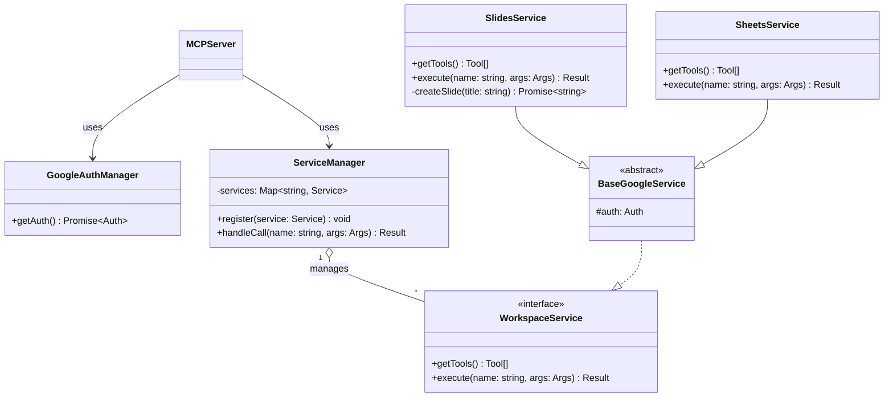

# Google Workspace MCP Server

Google Workspace MCPサーバーは、AIアシスタントと開発ツールが自然言語を介してGoogle Workspaceサービスと対話できるようにするモデルコンテキストプロトコル（MCP）実装です。
このサーバーは、標準化されたMCPインターフェースを通じて、10のGoogle Workspaceサービス（ドライブ、スプレッドシート、スライド、フォーム、タスク、チャット、検索）にわたる80以上のツールを公開します。

このシステムはFastMCP（バージョン2.12.5）上に構築されており、OAuth 2.0（デスクトップ/シングルユーザー）とOAuth 2.1（マルチユーザー/ウェブ）の両方のフローをサポートするマルチモード認証システムを実装しています。Claude DesktopのようなデスクトップAIクライアント向けのstdioと、ウェブベースおよびマルチユーザーシナリオ向けのstreamable-httpという2つの主要なトランスポートモードで動作します。

コードベースは、MCP Server Core（オーケストレーションと構成）、認証層（認証情報の管理とサービスインジェクション）、ツール層（Google Workspaceのサービス統合）という3つのアーキテクチャ層を中心に構成されています。

## プロジェクト構造

```sh
project-root/
├── src/
│   ├── index.ts                # MCP サーバーの起動
│   ├── auth.ts                 # 共通の Google 認証ロジック
│   ├── manager.ts              # MCP ツールの登録・振り分け (Context)
│   └── services/               # 各サービスの Strategy
│       ├── base.service.ts     # 共通インターフェース
│       └── slides.service.ts   # Slides 固有のロジック
├── Dockerfile                  # コンテナ定義
├── credentials.json            # 事前に用意
├── token.json                  # コンテナ外にマウントして永続化
└── package.json
```

## クラス構成



## 開発の始め方

```sh
npm run type-check
npm run lint
npm run format
npm run build
```

## Docker コンテナビルド

```sh
docker build --no-cache -t google-workspace-mcp .
```
