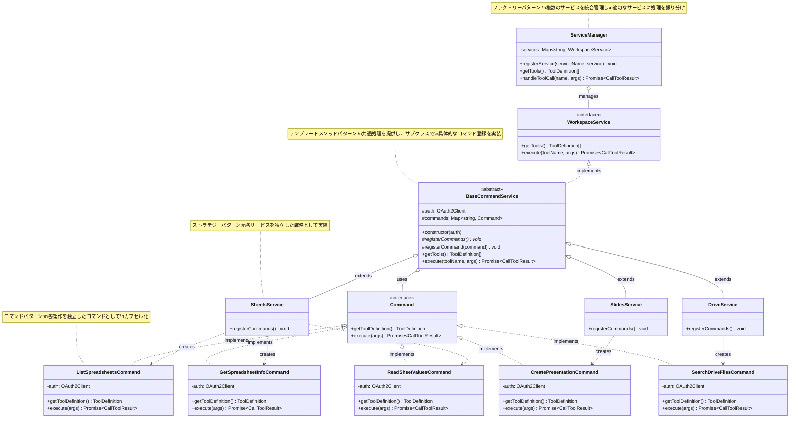

# Google Workspace MCP Server

Google Workspace MCP Server は、GitHub Copilot などの AI アシスタントから Google Workspace サービス（Slides、Sheets、Drive）を操作できるようにする MCP サーバーです。

## 主な機能

### 📊 Google Sheets

- **sheets_list_spreadsheets** - スプレッドシート一覧を取得
- **sheets_get_spreadsheet_info** - スプレッドシートの詳細情報（シート一覧、プロパティ）を取得
- **sheets_read_sheet_values** - セル範囲のデータを読み取り

### 🖼️ Google Slides

- **slides_create_presentation** - プレゼンテーションを作成
- **slides_get_presentation** - プレゼンテーションの内容を取得
- **slides_list_presentations** - プレゼンテーション一覧を取得
- **slides_get_page** - 特定スライドの詳細情報を取得

### 📁 Google Drive

- **drive_search_files** - ファイルを検索（クエリ構文対応）
- **drive_list_items** - フォルダ内のファイル一覧を取得

## クイックスタート

詳細なセットアップ手順は **[docs/setup.md](docs/setup.md)** を参照してください。

### 簡単な流れ

1. Google Cloud で OAuth 認証情報を作成
2. `credentials.json` をダウンロード
3. トークンを取得（初回のみ）
4. GitHub Copilot で使用開始

```sh
# 作業ディレクトリを作成
mkdir -p ~/google-workspace-mcp
cd ~/google-workspace-mcp

# credentials.json を配置して token.json を作成
touch token.json

# トークン取得（初回のみ）
docker run -it --rm \
  -p 8000:8000 \
  -v $(pwd)/credentials.json:/app/credentials.json \
  -v $(pwd)/token.json:/app/token.json \
  google-workspace-mcp npm run setup
```

## GitHub Copilot との連携

`.vscode/settings.json`:

```json
{
  "mcp.servers": {
    "google-workspace": {
      "command": "docker",
      "args": [
        "run",
        "-i",
        "--rm",
        "-v",
        "/absolute/path/to/credentials.json:/app/credentials.json:ro",
        "-v",
        "/absolute/path/to/token.json:/app/token.json",
        "google-workspace-mcp"
      ]
    }
  }
}
```

## プロジェクト構成

```
src/
├── index.ts                # MCP サーバー起動
├── auth/                   # OAuth 認証管理
├── manager/                # サービス統合管理
└── tools/                  # Google Workspace ツール実装
    ├── sheets/
    ├── slides/
    └── drive/
```

## クラス設計

このプロジェクトは複数のデザインパターンを組み合わせて、拡張性と保守性の高いアーキテクチャを実現しています。

### 採用しているデザインパターン

- **ストラテジーパターン**: 各 Google Workspace サービス（Sheets, Slides, Drive）を独立した戦略として実装
- **コマンドパターン**: 各ツールの操作を独立したコマンドクラスとしてカプセル化
- **ファクトリーパターン**: `ServiceManager` がサービスを統合管理し、適切なサービスに処理を振り分け
- **テンプレートメソッドパターン**: `BaseCommandService` が共通処理を提供し、サブクラスで具体的なコマンド登録を実装



### 開発コマンド

```sh
npm run type-check
npm run lint
npm run format
npm run build
```

## 参考ドキュメント

- [docs/setup.md](docs/setup.md) - 詳細なセットアップガイド
- [docs/how-to-create-credentials.md](docs/how-to-create-credentials.md) - Google Cloud 認証情報の作成方法
- [docs/docker-deployment.md](docs/docker-deployment.md) - 社内配布向けガイド

## 参考プロジェクト

- [google_workspace_mcp](https://github.com/taylorwilsdon/google_workspace_mcp)
