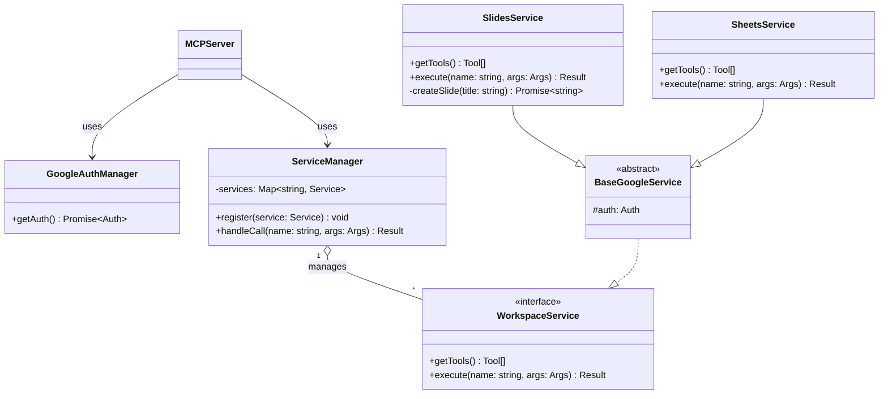

# Google Workspace MCP Server

Google Workspace MCPサーバーは、AIアシスタントと開発ツールが自然言語を介してGoogle Workspaceサービスと対話できるようにするモデルコンテキストプロトコル（MCP）実装です。
このサーバーは、標準化されたMCPインターフェースを通じて、10のGoogle Workspaceサービス（ドライブ、スプレッドシート、スライド、フォーム、タスク、チャット、検索）にわたる80以上のツールを公開します。

このシステムはFastMCP（バージョン2.12.5）上に構築されており、OAuth 2.0（デスクトップ/シングルユーザー）とOAuth 2.1（マルチユーザー/ウェブ）の両方のフローをサポートするマルチモード認証システムを実装しています。Claude DesktopのようなデスクトップAIクライアント向けのstdioと、ウェブベースおよびマルチユーザーシナリオ向けのstreamable-httpという2つの主要なトランスポートモードで動作します。

コードベースは、MCP Server Core（オーケストレーションと構成）、認証層（認証情報の管理とサービスインジェクション）、ツール層（Google Workspaceのサービス統合）という3つのアーキテクチャ層を中心に構成されています。

## プロジェクト構造

```sh
project-root/
├── src/
│   ├── index.ts                # MCP サーバーの起動
│   ├── auth.ts                 # 共通の Google 認証ロジック
│   ├── manager.ts              # MCP ツールの登録・振り分け (Context)
│   └── services/               # 各サービスの Strategy
│       ├── base.service.ts     # 共通インターフェース
│       └── slides.service.ts   # Slides 固有のロジック
├── Dockerfile                  # コンテナ定義
├── credentials.json            # 事前に用意
├── token.json                  # コンテナ外にマウントして永続化
└── package.json
```

## クラス構成



## 開発の始め方

```sh
npm run type-check
npm run lint
npm run format
npm run build
```

## セットアップ手順

### 1. Docker イメージのビルド

```sh
docker build -t google-workspace-mcp .
```

### 2. 初回トークンセットアップ（対話的）

初めて使用する場合は、OAuth トークンを取得する必要があります。

```sh
# セットアップモードでコンテナを起動
docker run -it --rm \
  -v $(pwd)/credentials.json:/app/credentials.json \
  -v $(pwd)/token.json:/app/token.json \
  google-workspace-mcp npm run setup
```

**実行内容：**

1. `credentials.json` の検証
2. ブラウザが開き、Google アカウントでログイン
3. 認可後、トークンが `token.json` に自動保存
4. Google Slides API で疎通テスト

**画面出力例：**

```
╔═══════════════════════════════════════════════════════════╗
║   Google Workspace MCP Server - 初回トークンセットアップ   ║
╚═══════════════════════════════════════════════════════════╝

✅ credentials.json の検証に成功しました。
🔐 Google OAuth 認証を開始します...
✅ 認証に成功しました！
💾 トークンを保存しました: /app/token.json
✅ トークンが有効です！Google Slides API との疎通に成功しました。

╔═══════════════════════════════════════════════════════════╗
║              🎉 セットアップが完了しました！               ║
╚═══════════════════════════════════════════════════════════╝
```

### 3. MCP サーバーの起動

トークン取得後は、通常の MCP サーバーモードで起動します。

```sh
docker run -i --rm \
  -v $(pwd)/credentials.json:/app/credentials.json:ro \
  -v $(pwd)/token.json:/app/token.json \
  google-workspace-mcp
```

**注意：**

- `credentials.json` は読み取り専用（`:ro`）でマウント
- `token.json` は読み書き可能（自動リフレッシュ対応）

### 4. Claude Desktop / MCP クライアントでの設定

`.vscode/mcp.json` の例：

```json
{
  "servers": {
    "google-workspace": {
      "command": "docker",
      "args": [
        "run",
        "--rm",
        "-i",
        "-v",
        "/path/to/your/credentials.json:/app/credentials.json:ro",
        "-v",
        "/path/to/your/token.json:/app/token.json",
        "google-workspace-mcp"
      ]
    }
  }
}
```

## 社内配布向けガイド

Docker コンテナとして社内メンバーに配布する場合の詳細な手順は、[docs/docker-deployment.md](docs/docker-deployment.md) を参照してください。

- tar ファイルでの配布方法
- Private Registry での配布方法
- エンドユーザー向けセットアップ手順
- トラブルシューティング
- セキュリティ考慮事項

## トラブルシューティング

### トークンの再取得

```sh
# 既存のトークンを削除
rm token.json

# セットアップを再実行
docker run -it --rm \
  -v $(pwd)/credentials.json:/app/credentials.json \
  -v $(pwd)/token.json:/app/token.json \
  google-workspace-mcp npm run setup
```

### credentials.json の取得方法

詳細は [docs/how-to-create-credentials.md](docs/how-to-create-credentials.md) を参照してください。
