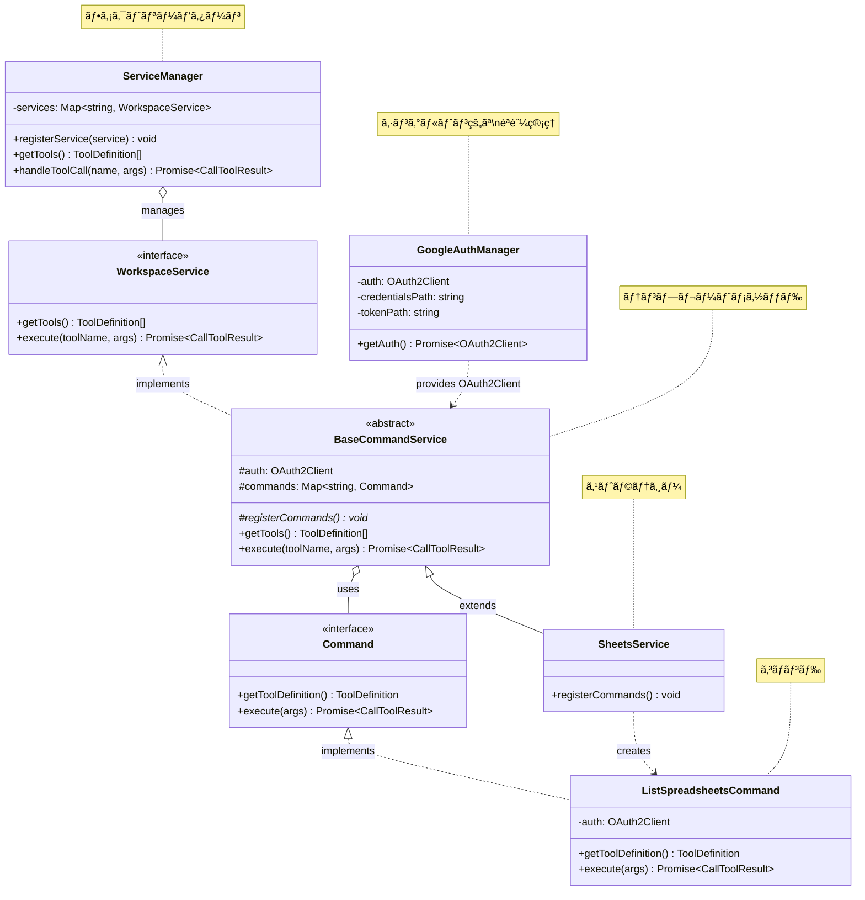

# Google Workspace MCP Server

Google Workspace MCP Server ã¯ã€GitHub Copilot ãªã©ã® AI アシスタントã‹ã‚‰ Google Workspace サービス（Slidesã€Sheetsã€Drive）をæ“作ã§ãるよã†ã«ã™ã‚‹ MCP サーãƒãƒ¼ã§ã™ã€‚

## 主ãªæ©Ÿèƒ½

### 📊 Google Sheets

- **sheets_list_spreadsheets** - スプレッドシート一覧をå–å¾—
- **sheets_get_spreadsheet_info** - スプレッドシートã®è©³ç´°æƒ…報（シート一覧ã€ãƒ—ロパティ）をå–å¾—
- **sheets_read_sheet_values** - セル範囲ã®ãƒ‡ãƒ¼ã‚¿ã‚’読ã¿å–ã‚Š

### ğŸ–¼ï¸ Google Slides

- **slides_create_presentation** - プレゼンテーションを作æˆ
- **slides_get_presentation** - プレゼンテーションã®å†…容をå–å¾—
- **slides_list_presentations** - プレゼンテーション一覧をå–å¾—
- **slides_get_page** - 特定スライドã®è©³ç´°æƒ…報をå–å¾—

### 📠Google Drive

- **drive_search_files** - ファイルを検索（クエリ構文対応）
- **drive_list_items** - フォルダ内ã®ãƒ•ã‚¡ã‚¤ãƒ«ä¸€è¦§ã‚’å–å¾—

## クイックスタート

### ç°¡å˜ãªæµã‚Œ

1. Google Cloud 㧠OAuth èªè¨¼æƒ…報を作æˆï¼ˆåˆå›ã®ã¿ï¼‰
2. `credentials.json` をダウンロード（åˆå›ã®ã¿ï¼‰
3. トークンをå–得（åˆå›ã®ã¿ï¼‰
4. GitHub Copilot ã§ä½¿ç”¨é–‹å§‹

詳細ãªã‚»ãƒƒãƒˆã‚¢ãƒƒãƒ—手順㯠**[docs/setup.md](docs/setup.md)** ã‚’å‚ç…§ã—ã¦ãã ã•ã„。

## プロジェクト構æˆ

```
src/
├── index.ts                # MCP サーãƒãƒ¼èµ·å‹•
├── auth/                   # OAuth èªè¨¼ç®¡ç†
├── manager/                # サービス統åˆç®¡ç†
└── tools/                  # Google Workspace ツール実装
    ├── sheets/
    ├── slides/
    └── drive/
```

## クラス設計

ã“ã®ãƒ—ロジェクトã¯è¤‡æ•°ã®ãƒ‡ã‚¶ã‚¤ãƒ³ãƒ‘ターンを組ã¿åˆã‚ã›ã¦ã€æ‹¡å¼µæ€§ã¨ä¿å®ˆæ€§ã®é«˜ã„アーキテクãƒãƒ£ã‚’実ç¾ã—ã¦ã„ã¾ã™ã€‚

### æ¡ç”¨ã—ã¦ã„るデザインパターン

- **ストラテジーパターン**: å„ Google Workspace サービス（Sheets, Slides, Drive）を独立ã—ãŸæˆ¦ç•¥ã¨ã—ã¦å®Ÿè£…
- **コãƒãƒ³ãƒ‰ãƒ‘ターン**: å„ツールã®æ“作を独立ã—ãŸã‚³ãƒãƒ³ãƒ‰ã‚¯ãƒ©ã‚¹ã¨ã—ã¦ã‚«ãƒ—セル化
- **ファクトリーパターン**: `ServiceManager` ãŒã‚µãƒ¼ãƒ“スを統åˆç®¡ç†ã—ã€é©åˆ‡ãªã‚µãƒ¼ãƒ“スã«å‡¦ç†ã‚’振り分ã‘
- **テンプレートメソッドパターン**: `BaseCommandService` ãŒå…±é€šå‡¦ç†ã‚’æä¾›ã—ã€ã‚µãƒ–クラスã§å…·ä½“çš„ãªã‚³ãƒãƒ³ãƒ‰ç™»éŒ²ã‚’実装


```mermaid
classDiagram
    %% èªè¨¼ç®¡ç†
    class GoogleAuthManager {
        -auth: OAuth2Client
        -credentialsPath: string
        -tokenPath: string
        +getAuth() Promise~OAuth2Client~
    }

    %% コアインターフェース
    class Command {
        <<interface>>
        +getToolDefinition() ToolDefinition
        +execute(args) Promise~CallToolResult~
    }

    class WorkspaceService {
        <<interface>>
        +getTools() ToolDefinition[]
        +execute(toolName, args) Promise~CallToolResult~
    }

    %% 基底クラスã¨ãƒãƒãƒ¼ã‚¸ãƒ£ãƒ¼
    class BaseCommandService {
        <<abstract>>
        #auth: OAuth2Client
        #commands: Map~string, Command~
        #registerCommands()* void
        +getTools() ToolDefinition[]
        +execute(toolName, args) Promise~CallToolResult~
    }

    class ServiceManager {
        -services: Map~string, WorkspaceService~
        +registerService(service) void
        +getTools() ToolDefinition[]
        +handleToolCall(name, args) Promise~CallToolResult~
    }

    %% 具体例（代表）
    class SheetsService {
        +registerCommands() void
    }

    class ListSpreadsheetsCommand {
        -auth: OAuth2Client
        +getToolDefinition() ToolDefinition
        +execute(args) Promise~CallToolResult~
    }

    %% 関係性
    GoogleAuthManager ..> BaseCommandService : provides OAuth2Client
    WorkspaceService <|.. BaseCommandService : implements
    BaseCommandService <|-- SheetsService : extends
    ServiceManager o-- WorkspaceService : manages
    Command <|.. ListSpreadsheetsCommand : implements
    BaseCommandService o-- Command : uses
    SheetsService ..> ListSpreadsheetsCommand : creates

    note for GoogleAuthManager "シングルトン的ãª\nèªè¨¼ç®¡ç†"
    note for ServiceManager "ファクトリーパターン"
    note for BaseCommandService "テンプレートメソッド"
    note for SheetsService "ストラテジー"
    note for ListSpreadsheetsCommand "コãƒãƒ³ãƒ‰"
```

> **Note**: 図ã¯ä»£è¡¨çš„ãªã‚¯ãƒ©ã‚¹ã®ã¿ã‚’表示ã—ã¦ã„ã¾ã™ã€‚実際ã«ã¯ Slides/Drive サービスやå„種コãƒãƒ³ãƒ‰ã‚¯ãƒ©ã‚¹ã‚‚åŒæ§˜ã®ãƒ‘ターンã§å®Ÿè£…ã•ã‚Œã¦ã„ã¾ã™ã€‚

## å‚考ã«ã—ãŸãƒ—ロジェクト

- [google_workspace_mcp](https://github.com/taylorwilsdon/google_workspace_mcp)
