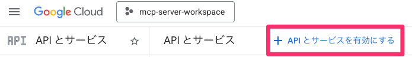

# OAuth 認証情報（CLIENT_ID、SECRET）の取得手順

Google Workspace を操作するためには、OAuth 認証情報が必要です。以下の手順で `credentials.json` を取得してください。

---

## 1. プロジェクト作成

[Google Cloud Console](https://console.cloud.google.com/) で新規プロジェクトを作成します。

| 項目           | 値                     |
| -------------- | ---------------------- |
| プロジェクト名 | `mcp-server-workspace` |

## 2. API の有効化

1. 上部のプロジェクト選択から **mcp-server-workspace** を選択
2. 「APIとサービス」 > 「有効なAPIとサービス」 へ移動
3. 「APIとサービスの有効化」ボタンをクリック
4. 以下のAPIを検索して有効化します：

- ✅ Google Sheets API
- ✅ Google Slides API
- ✅ Google Drive API

## 3. OAuth 同意画面の設定

メニューから「OAuth 同意画面」 を選択し、以下の情報を入力します。

**① アプリ情報**

| 項目                   | 値                                |
| ---------------------- | --------------------------------- |
| アプリ名               | `MCP Server for Google Workspace` |
| ユーザーサポートメール | 自分のメールアドレス              |

→ 「次へ」をクリック

**② 対象**

| 項目 | 値     |
| ---- | ------ |
| 対象 | `内部` |

→ 「次へ」をクリック

**③ 連絡先情報**

| 項目           | 値                   |
| -------------- | -------------------- |
| メールアドレス | 自分のメールアドレス |

## 4. OAuth クライアントを作成

1. 「認証情報」メニューから「認証情報を作成」をクリック
2. 「OAuth クライアント ID」を選択

| 項目                   | 値                        |
| ---------------------- | ------------------------- |
| アプリケーションの種類 | `デスクトップアプリ`      |
| 名前                   | `MCP Server OAuth Client` |

3. 「作成」ボタンをクリック
4. クライアント ID とクライアント シークレットが表示されます
5. **「JSON をダウンロード」** し、ファイル名を `credentials.json` に変更

> **重要**: この `credentials.json` ファイルは次のステップで使用します。

---

次のステップ: [トークンの取得](./how-to-get-token.md)
